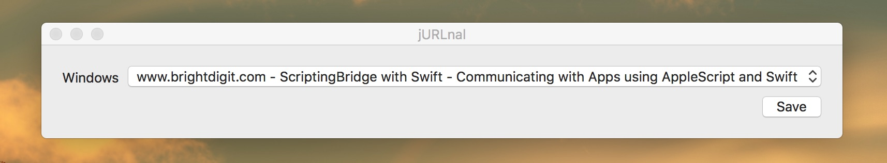

# jURLnal

Sample Application using ScriptingBridge and Swift to copy URLs from Safari Windows to the clipboard.

This app uses ScriptBridging and [SwiftScripting](https://github.com/tingraldi/SwiftScripting) to talk to the AppleScript Safari API using only Swift.

For reference see the [blog post here](http://brightdigit.com/blog/17/06/09/scriptingbridge-with-swift-communicating-with-apps-using-applescript-and-swift/).
